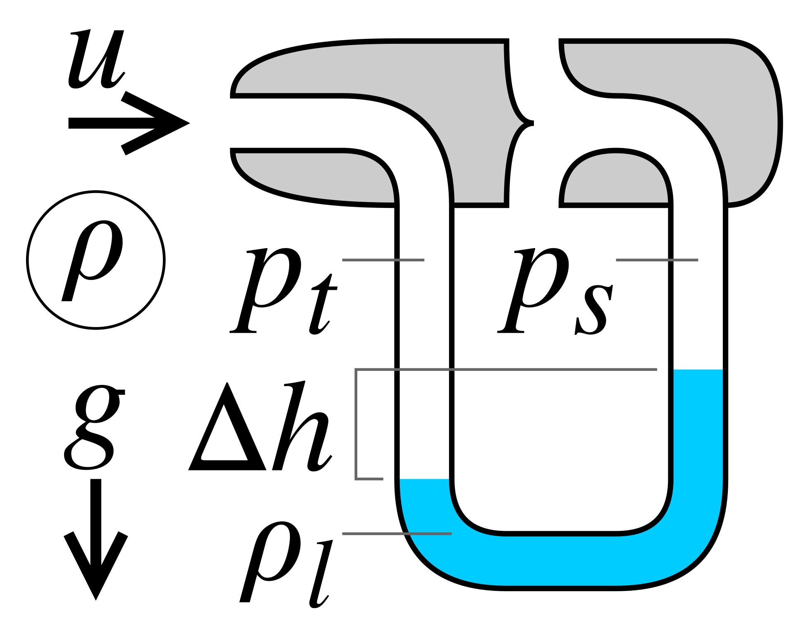
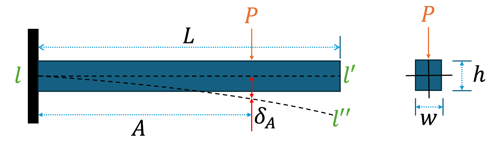

# **Assignment 1: Newton Solver**  

## **Overview**  
This repository contains a Python implementation of the **Newton-Raphson method** for solving nonlinear equations and systems of equations. The solver takes in a function, its Jacobian matrix, initial guesses, a tolerance value, and a maximum number of iterations to find the roots of the equation(s).  

The project includes:  
- `Newton_Solver.py` → The main solver implementation  
- `test_NewtonSolver.py` → Unit tests using `pytest`  
- `tutorials_NewtonSolver.ipynb` → A Jupyter Notebook with detailed examples  

---

## **Installation & Requirements**  
Ensure you have **Python 3.12** installed along with the following dependencies:  

```bash
pip install numpy matplotlib pytest
```

---
**Please ensure that you run the following commands in the terminal after downloading the repository (Please ensure that repository is not in the downloads folder and their relative locations are not changed.)**\
To install the package, first create a virtual environment:
```bash
conda create --name newton-solver-env python=3.12
```
Once the environment has been created, activate it:
```bash
conda activate newton-solver-env
```
Double check that python is version 3.12 in the environment:
```bash
python --version
```
Please ensure that pip is using the most up to date version of setuptools:
```bash
pip install --upgrade pip setuptools wheel
```
Create the editable install of the Newton Solver code (note: you must be in the correct directory, i.e. where all of the files of the repository are.)
```bash
pip install -e .
```
Test the code is working with pytest
```bash
pytest -v --cov=Newton_Solver --cov-report term-missing
```

## **Usage**  
### **Importing the Solver**  
To use the solver, first import it into your script or notebook:  

```python
from Newton_Solver import Newton_Solver as ns
import numpy as np
from pathlib import Path
from typing import Callable
```

### **Calling the Newton Solver Function**  
The function can be called as:  

```python
ns.run_newton_solver(F, J, x0_list, tol, max_iter)
```

#### **Function Parameters:**  
| Parameter   | Description |
|------------|-------------|
| `F`        | Function(s) whose roots are to be found (should return a NumPy array). |
| `J`        | Jacobian matrix of `F` (should return a NumPy matrix). This needs to be provided by user) |
| `x0_list`  | List of initial guesses. |
| `tol`      | Convergence tolerance (small positive float). |
| `max_iter` | Maximum number of iterations before stopping. |

#### **Example Usage: Finding roots of \( f(x) = x^2 - 4 \)**  
```python
F = lambda x: np.array([x**2 - 4])
J = lambda x: np.array([[2*x]])
x0_list = [5, -5, 1, -1]
roots = ns.run_newton_solver(F, J, x0_list, tol=1e-6, max_iter=100)
print("Roots found:", roots)
```
---
This will return roots as a *NumPy* array which might require a little bit of post processing for more presentable form.

---

## **Tutorials & Examples**  
To run the tutorial, user needs to install jupyter:
```bash
pip install jupyter
```
Then change the directory to tutorials folder:
```bash
cd tutorials_NewtonSolver/
```
Run the tutorial file:
```bash
jupyter notebook tutorials_NewtonSolver.ipynb
```
The **`tutorials_NewtonSolver.ipynb`** file provides detailed examples, including:  
#### Finding roots of \($\sin{x} = 0$\)
This example demonstrates the functionality of Newton solver by finding multiple roots close to the given initial guesses.

#### Finding fixed points of a first-order ODE
Fixed point of a differential equation let's say $\dot{x} = f(x)$ is the point where $f(x) = 0$. It means that it is the where derivative of the function is zero. Please note that here we are talking about $x = x(t)$ as a function itself (not to be confused with $f(x)$). It is the point where function stops either increasing or decreasing. It is sometimes reffered to as a [stationary point](https://en.wikipedia.org/wiki/Stationary_point).\
The stationary point for $\dot{x} = f(x)$ can be calculated by taking $f(x) = 0$ and then finding its roots.\
Second example demonstrate how we can use Newton solver to calculate a fixed point of a first order ordinary differential equation $\dot{x} = x^2 -25x + 100$ for multiple initial guesses. It also demonstrates that the function returns just the unique roots even if multiple guesses converge to the same values.
#### (Mechanics) Measuring fluid velocity in a pipe using a pitot tube
Pitot tube is a device that is used to measure the velocity of an incompressible fluid in a pipe using the Bernoulli's principle. Bernoulli's equation along a streamline for a fluid flowing between point $m$ and $n$ is given as:
$$P_m + \frac{1}{2}\rho V_m^2 + \rho g z_m = P_n + \frac{1}{2}\rho V_n^2 + \rho g z_n$$
where, $P$ represent pressure, $\rho$ represents density, $V$ is velocity, $g$ is acceleation due to gravity and $z$ is the height from a datum. The subscripts $m$ and $n$ refer to the parameters at point $m$ and $n$ respectively.\
For a horizontal pipe, $z_m = z_n$. Now, pitot tube works in such a way that it can be used to at least find the difference between the stagnation pressure (where velocity is $0$) and the static pressure (pressure in flowing fluid).
<p align="center">
  
</p>
<p align="center">Figure 1: Principle of working of a pitot tube using a manometer.</p>

Let's represent stagnationation pressure by $p_t$ and static pressure by $p_s$ as shown in Figure 2. At the point where we are measuring the static pressure, the velocity will be zero and let's say the velocity where we are measuring the static pressure is $u$, then Bernoulli's equation reduces to:
$$p_t = p_s + \frac{\rho u^2}{2}$$
Now, we can try to calculate the velocity using Newton Solver for a given set of parameters (please note that $x$ represents velocity in the tutorial example).\
**Note:** Figure 1 was downloaded from [here](https://en.wikipedia.org/wiki/Pitot_tube#/media/File:Pitot_tube_manometer.svg). For more information about pitot tube, please visit [Wikipedia](https://en.wikipedia.org/wiki/Pitot_tube#).
#### (Mechanics) Deflection of a rectangular cantilever beam due to concentrated load.
Let's take a cantilever beam of length $L$, and let's say that a load $P$ is acting vertically (through neutral axis) at a distance $A$ from the fixed end. Then the deflection at that point (see Figure 2 in which the neutral axis $l-l'$ is deforming to $l-l''$ as described) can be calculated as:
$$\delta_{A} = \frac{PA^2(3L - A)}{6EI}$$
where, $E$ is the Young's modulus of the beam and $I$ is the second moment of area along the axis that is perpendicular to the direction in which load is applied. For a rectangular beam with width $w$ and height $h$, $I$ can be calculated as:
$$I = \frac{wh^3}{12}$$
<p align="center">
  
</p>
<p align="center">Figure 2: A cantilever beam undergoing deformation due to a point load.</p>

The implementation of this example in the notebook shows that how we can calculate the distance $A$ using bisection method if other parameters are given. It has to be noted that the limits on the interval cannot be farther than $L$. If Newton solver is giving a result which lies either outside this or it is not converging then there might have been a mistake while selecting appropriate parameters. For more information about cantilever or other beams, please visit [Wikipedia](https://en.wikipedia.org/wiki/Deflection_(engineering)).

#### Fixed Point of a 2D system.
This tutorial demonstrates the functionality of Newton solver for solving a higher order system with multiple variable. Two nonlinear equations with variables $x$ and $y$ are chosen as:
$$F_1(x,y) = x^2 + y^2 - 4$$
$$F_2(x,y) = e^x + y - 1$$
Multiple guesses are passed to demonstrate that Newton solver can handle multiple guesses and still return the unique solutions.


---

## **Error Handling & Warnings**  
The solver raises errors in the following cases:  
- If the Jacobian matrix is singular (`ValueError: Jacobian matrix is singular.`)  
- If the solver does not converge within the given iterations (`RuntimeError: Newton solver did not converge...`)  
- If the function and initial guesses do not match in dimensions (`ValueError: The inputs are either missing expressions or initial guesses.`)

## Final remarks for the user
User is encouraged to play with different parameters in *test_NewtonSolver.py* and *tutorials_NewtonSolver.ipynb* notebook to check how the script *Newton_Solver.py* works under different scenarios.